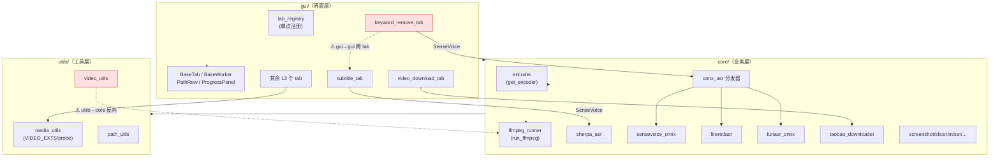

# 架构评审报告（第二轮 · 2026-08-20）

> 评审对象：`D:\JR_project\video_random_cut_mimo`（PyQt5 单机桌面视频批处理工具，千川电商短视频素材生产链路）
> 评审方式：**实地读代码**（main / gui 公共层 / 三大 GUI 文件 / core/ASR 五兄弟 / taobao_downloader / utils / requirements / 工程化现状）
> 背景：用户已在 2026-08-20 完成 P0+P1+P2 三轮重构，本次是「重构后回头看，还需不需要继续优化」的复查。
> 说明：2026-08-19 已有一份 `docs/architecture-review-2026-08-19.html`（第一轮）。第一轮列出的 P0/P1/P2 公共层改造**本次核对已基本落地**，本报告聚焦落地后的**残余架构债**，不再重复推荐已做完的事。

---

## 一、结论先行

**一句话结论**：需要继续优化，但已经不是「地基问题」，而是「减重 + 收口」问题。建议再做**一轮以依赖收敛和死代码清理为主的轻量优化**，重点把 `requirements` 依赖理顺、把零散重复收口；**不建议做大拆大改**。

**架构健康度打分（维度评分，10 分制）**

| 维度 | 得分 | 说明 |
|------|------|------|
| 公共执行层（encoder / ffmpeg_runner） | 9 | 统一编码、统一进程追踪、无黑窗、硬件回退，做得很扎实 |
| 注册表与线程/控件标准化（tab_registry / BaseWorker / BaseTab / PathRow / ProgressPanel） | 9 | 单点注册、统一信号契约、统一路径行/进度条，明显消除了重复 |
| 安全（密钥独立 config.local.json） | 8 | 密钥已隔离，不入库不进 git |
| 模块分层（gui → core → utils 方向） | 6 | 主体方向正确，但存在 utils→core 反向依赖 + GUI 仍残留部分业务逻辑 |
| 冗余/死代码（5 个 ASR 模块、SenseVoice 双实现） | 5 | 功能都能跑，但体量过大、维护成本高、依赖纠缠 |
| 依赖与可安装性（requirements 偏离运行时） | 4 | torch/demucs 偏重、sherpa_onnx 缺失声明，安装风险真实存在 |
| 工程化（测试 / CI / 打包） | 3 | 无测试、无 CI、无打包脚本，只有 `Random_cut.bat` 直接 `python main.py` |
| 大文件可读性（taobao_downloader 1437 行等） | 5 | 单体文件过大，bug 定位成本高 |

**综合**：地基已稳（公共层 + 注册表 + 线程标准化是这轮做对的核心），剩余债务以「脂肪」为主、危机型债务少。继续优化的 ROI 主要体现在**安装更省心**和**以后改 bug/加功能更便宜**两层。

---

## 二、已完成重构的评价（客观说做对了什么）

不吹，实事求是：

1. **公共执行层真正统一了**。`core/encoder.py` 的 `get_encoder()` + `core/ffmpeg_runner.py` 的 `run_ffmpeg / run_ffmpeg_with_fallback / track_proc / terminate_all` 是项目里设计最干净的部分。实测重编码路径（fission / resizer / keyword_remover / subtitle / concat / `utils/video_utils`）都已通过 `run_ffmpeg_with_fallback(build_cmd, crf=23, …)` 把编码参数交给 `get_encoder`，「编码参数必须走 get_encoder」这条铁律**基本贯彻**（subtitle 烧录路径见 `gui/subtitle_tab.py:144-158` 已正确接入）。
2. **tab 单点注册表修掉了一个真实 bug**。`gui/tab_registry.py` 用 `vars(tab)` 全量扫描 `QThread` 属性来停线程，顺手修了 `video_download_tab` 双线程（worker / login_worker）泄漏——这是从「手写属性名列表」升级成「自动扫描」带来的实质好处，不是花架子。
3. **BaseWorker / BaseTab / PathRow / ProgressPanel 消除了大量重复**。16 个 tab 的信号契约、防重入、路径选择行、进度条现在统一，新增 tab 的样板代码大幅减少。
4. **密钥隔离到位**。`gui/config.py` 把 api_key / secret 独立到 `config.local.json`（原子写盘 + 不入库），安全层面是实打实的提升。

这四点说明：这轮重构的「方向感」是对的——**先立公共层、再让业务层往上贴**，符合单机小工具「降低后续加功能/改 bug 成本」的判断标准。

---

## 三、剩余架构债清单

> 每个问题都附「大白话：这对我意味着什么」。严重度：高/中/低。修复成本：高/中/低。ROI：高/中/低。

| 编号 | 问题 | 证据（文件:行 / grep） | 大白话：这对我意味着什么 | 影响 | 严重度 | 修复成本 | ROI |
|------|------|------------------------|--------------------------|------|--------|----------|-----|
| D1 | **requirements 与运行时偏离**：torch/torchaudio 仅用于可选功能（whisper 独立进程、cosyvoice_server 子进程），demucs 用于人声分离；而 `sherpa_onnx` 被多个模块 import 却**不在 requirements** | `requirements.txt:7-9`；grep：`torch` 仅 `_whisper_transcribe.py:61`、`services/cosyvoice_server.py:51`；`sherpa_onnx` 被 `fireredasr.py:405`/`onnx_asr.py:73,89`/`sherpa_asr.py:12` import，但 requirements 无此行 | 换电脑/重装时，你大概率会卡在 torch 的 `shm.dll WinError 127`，而且「字幕 SenseVoice」要用的 sherpa_onnx 因为没写进依赖，别人照着 requirements 装会直接跑不起来 | 安装失败、环境不可复现 | 中高 | 低 | 高 |
| D2 | **5 个 ASR 模块并存 + SenseVoice 双实现**：`fireredasr / funasr_onnx / sensevoice_onnx / onnx_asr（分发器）/ sherpa_asr` 共约 2116 行；且 **SenseVoice 有两条不同底层实现**——字幕页走 `sherpa_asr`（sherpa_onnx 库），去关键词页走 `onnx_asr → sensevoice_onnx`（纯 onnxruntime） | `gui/subtitle_tab.py:70-75`（SenseVoice→SherpaASR）；`gui/keyword_remove_tab.py:52,315`（SenseVoice→OnnxASR→sensevoice_onnx）；`core/onnx_asr.py:44-63` | 你其实只想要「能识别字幕的模型」，但现在仓库里躺着 5 套近 2000 行、两套 SenseVoice 各写一遍。以后改 ASR 要同时改好几处，且依赖一团乱 | 维护成本高、依赖纠缠、易改漏 | 中 | 中 | 中 |
| D3 | **GUI 层仍残留业务逻辑**：`subtitle_tab.py`（732 行）的 `SubtitleWorker` 内含字幕烧录 FFmpeg 命令拼接、`SRT/ASS` 颜色转换、Whisper 独立进程分支；检测核心虽在 `core/screenshot.py`，但 tab 内仍做大量编排 | `gui/subtitle_tab.py:99-158`（_burn_subtitles / _get_position_style / _build_burn_cmd） | 加新功能时，业务逻辑散在界面文件里，你想改「字幕怎么烧」得钻进界面代码，容易牵一发动全身 | 关注点未分离、回归风险 | 中 | 中 | 中 |
| D4 | **utils ↔ core 反向依赖**：`utils/video_utils.py:5` `from core.ffmpeg_runner import …`（utils→core），而 `core/*` 又普遍 `from utils.media_utils / utils.video_utils import …`（core→utils）。虽未形成硬循环，但打破了 gui→core→utils 单向约定 | `utils/video_utils.py:5`；`core/keyword_remover.py:6-7`、`core/mixer.py:7-8`、`core/screenshot.py:8` | 目前没出 bug，但「底层工具反过来依赖上层」一旦养成习惯，以后加模块会越来越绕、越来越难拆 | 扩展性隐患 | 低 | 低 | 低-中 |
| D5 | **跨 tab 耦合**：`keyword_remove_tab.py:17` `from gui.subtitle_tab import FIREMODELS_DIR, FUNASR_DIR, SENSEVOICE_DIR` | `gui/keyword_remove_tab.py:17` | 去关键词页依赖字幕页的常量，字幕页一改常量名，去关键词页就跟着崩 | 隐性耦合 | 低 | 低 | 低 |
| D6 | **VIDEO_EXTS 字面量重复**：多个 tab 自己写死 `(".mp4",".avi",".mov",".mkv",".flv")` 而非引用已单点化的 `media_utils.VIDEO_EXTS` | `gui/subtitle_tab.py:57`、`gui/face_detection_tab.py:120`（screenshot/keyword 等亦有） | 哪天你想加个 `.webm` 支持，得在 N 个文件里挨个改，漏一个就少扫一种格式 | 扩展易漏改 | 低 | 低 | 中 |
| D7 | **taobao_downloader.py 巨型单文件**（1437 行、约 40 个函数）：淘宝 + 抖音双站、URL 解析 + 浏览器会话 + 多种视频抽取策略 + 下载编排全塞一个文件 | `core/taobao_downloader.py`（grep 出 40 个 def，淘宝/抖音抽取函数各一簇） | 下载功能一旦出 bug，要在这个 1400 行的文件里大海捞针 | bug 定位成本高 | 中 | 高 | 低 |
| D8 | **无测试 / 无 CI / 无打包脚本**：只有 `Random_cut.bat` 直接 `python main.py` | glob：`tests/`、`*.spec`、`setup.py`、`pyproject.toml`、`.github/` 均无 | 你换电脑或我帮你改完代码后，没法一键验证「有没有把别的功能改坏」 | 回归无保障 | 中 | 中 | 中 |
| D9 | **wink_enhancer 8 元组返回值**（已知 backlog）：返回结构未标准化，调用方需按位置取 8 个值 | `core/wink_enhancer.py:216 process()` 等（第一轮已记录）；注：它走外部 Wink exe，不涉编码铁律 | 调用方代码可读性差，以后改返回值顺序容易出隐蔽 bug | 易出隐蔽 bug | 低 | 低 | 低 |
| D10 | **回退默认 crf 不一致**：`run_ffmpeg_with_fallback` 默认 `crf=20`，而 canonical 为 `crf=23`（video_resizer 用 23），各模块传入值不统一 | `core/ffmpeg_runner.py:285`（crf=20 默认）；`gui/subtitle_tab.py:156`（crf=23） | 不同功能导出的视频画质/体积略有差异，你未必察觉，但属于「同一工具两种默认」的不一致 | 输出不一致 | 低 | 低 | 低 |

---

## 四、分层依赖现状（Mermaid）

**解读**：
- 主干 `gui → core → utils` 方向正确，公共层（encoder/ffmpeg_runner）被稳定依赖。
- 两个红点需要收口：① `utils/video_utils.py` 反向 import `core/ffmpeg_runner`（utils 不再是干净叶子层）；② `keyword_remove_tab` 跨 tab 依赖 `subtitle_tab` 的模型路径常量。
- ASR 区域是典型的「扇入过多 + 双 SenseVoice」：同一能力有两套实现，且 `sherpa_asr` 与 `sensevoice_onnx` 互相不共享。

---

## 五、下一轮优化建议（按 ROI 分 P0 / P1 / P2）

### P0：无（本轮没有必须立刻做的危机型债务）
> 第一轮 P0（密钥隔离、线程泄漏、编码统一、注册表单点化）已落地，本轮**不建议再排 P0**。把精力放在「减重」上收益更高。

### P1（高 ROI、低风险，建议本轮做）

**P1-1 · 收敛 requirements.txt（依赖收口）**
- 改什么：把 `torch`、`torchaudio` 移出主依赖，单独放 `requirements-optional.txt`（标注「仅 Whisper 独立进程 / 音色复刻 cosyvoice_server 需要」）；`sherpa_onnx` **补回**到主依赖（字幕 SenseVoice 实际要它）；`demucs` 保留（人声分离核心链路用到 `audio_utils.separate_vocals`）。
- 用户能感知到什么：换电脑/重装时**不再卡在 torch 的 shm.dll 报错**，主依赖更轻、装得更快；环境可复现。
- 几个提交能完成：1–2 个提交（改 requirements + 加一份可选依赖文件 + 注释）。
- 风险点：低。注意先确认你机器上 torch/demucs 现状（见待确认 Q2），别误删仍在用的东西。

**P1-2 · 收口 GUI 层重复（VIDEO_EXTS + 跨 tab 常量）**
- 改什么：① 各 tab 里手写的 `(".mp4",".avi",".mov",".mkv",".flv")` 改为 `from utils.media_utils import VIDEO_EXTS`；② 把 `subtitle_tab` 的 `FIREMODELS_DIR/FUNASR_DIR/SENSEVOICE_DIR` 等模型路径常量抽到 `core/` 或一个 `config/paths.py`，`keyword_remove_tab` 改为引用，切断 gui→gui 耦合（D5/D6）。
- 用户能感知到什么：短期无功能变化；**长期好处是以后加新格式/新功能少踩坑、少漏改**。
- 几个提交能完成：2–3 个提交。
- 风险点：低-中，需回归「字幕 / 去关键词」两个功能确认路径常量没改错。

### P2（中 ROI、按需做，不急）

**P2-1 · ASR 收敛（选定一条 SenseVoice 路径 + 评估保留范围）**
- 改什么：保留 `onnx_asr` 作为唯一分发器；SenseVoice 统一走 `sensevoice_onnx`（纯 onnxruntime），让 `subtitle_tab` 的 SenseVoice 也改用 `OnnxASR`（而非 `sherpa_asr`），之后**删除或冻结 `sherpa_asr.py`**；与用户确认 `funasr_onnx` / `fireredasr` 是否都还要（D2）。
- 用户能感知到什么：功能表现不变，但以后动 ASR 只改一处，依赖（sherpa_onnx）可减负。
- 几个提交能完成：3–5 个提交。
- 风险点：中。必须做模型路径 + 识别效果的回归，别动到「业务铁律」相关的输出规格。

**P2-2 · taobao_downloader 内部分区（不强行拆，先分块 + 抽抖音）**
- 改什么：在不破坏浏览器自动化脆弱链路的前提下，① 文件内用清晰分区注释（URL 解析 / 浏览器会话 / 淘宝抽取簇 / 抖音抽取簇 / 下载编排）；② 把抖音簇（`_extract_douyin_*`、`extract_douyin_video`）抽到 `core/douyin_downloader.py`。**不做彻底微服务式拆分**。
- 用户能感知到什么：几乎无；但以后下载出 bug 你/我能更快定位到是哪一段。
- 几个提交能完成：2–3 个提交。
- 风险点：中。Playwright 选择器很脆，抽离时别改既有逻辑，先只搬不动。

**P2-3 · 最小工程化保障（冒烟 + 自检，不堆测试框架）**
- 改什么：加一个 `scripts/smoke_import.py`（import 所有 tab / core 模块，验证启动不缺依赖）+ 一个 `check_env.bat`（检查 ffmpeg、python 版本、关键依赖是否装齐）。**不引入 pytest 全套 / 不搭 CI**（单机小工具过度工程）。
- 用户能感知到什么：换电脑后能一键验证「环境齐不齐、能不能跑」，省去报错后瞎猜。
- 几个提交能完成：1–2 个提交。
- 风险点：低。

---

## 六、明确不建议做的事（防止过度工程）

针对「单机桌面小工具」定位，以下**不要做**：

1. **不要引入 DI 框架 / 插件化 tab 机制**——tab 用 `tab_registry` 单点注册已经足够，再加抽象层只会增加你理解和改代码的成本。
2. **不要把工具改造成 Web / 微服务 / 多进程微服务**——它就是一台电脑上跑的桌面程序，局域网/云端化是另一个项目，不是「架构优化」。
3. **不要为「架构好看」去做 micro-module 拆分**——尤其是 `taobao_downloader` 不要拆成十几个小文件，内部分区 + 抽抖音簇足够。
4. **不要引入重型测试框架与完整 CI 流水线**——单机工具，一个 import 冒烟脚本 + 自检 bat 比 Jenkins/GitHub Actions 实用得多。
5. **不要用 asyncio / 异步框架重写线程模型**——现有的 `BaseWorker(QThread)` + 协作式停止已经统一且工作良好，重写风险高、收益低。
6. **不要改「业务铁律」**：视频输出规格（9:16 / 1080×1920 / `setsar=1`）、滤镜链、编码参数必须走 `get_encoder`——这些是你确认过的硬规矩，本报告的优化**不涉及**它们。

---

## 七、待用户确认的问题（最多 3 条）

**Q1（决定 D2 / P2-1 范围）**：你日常字幕 / 去关键词到底用哪几个 ASR 模型？FireRedASR / FunASR / SenseVoice / Whisper 里，**哪些可以确认不用、允许我删**？另外注意：字幕页的「SenseVoice」和去关键词页的「SenseVoice」底层实现其实不一样（两套），你两个都在用吗？

**Q2（决定 D1 / P1-1 范围）**：换电脑 / 重装时，`torch`（shm.dll 报错）和 `demucs` 是不是主要痛点？你能否接受把「音色复刻、Whisper 字幕」标成**需单独装依赖的可选功能**（主依赖不再强制装 torch）？

**Q3（决定 D10 / 铁律收口范围）**：你希望我把「所有重新编码都必须走 `get_encoder(crf=23)`」这条铁律继续收紧到 100%（含尚未统一接入的 `video_enhance` 等），还是保持现状（重编码已接入、外部工具 Wink 不动）？

---

## 八、附录：本轮实地核查要点

- ✅ 公共层（encoder / ffmpeg_runner / media_utils / path_utils / tab_registry / common）设计扎实，已实际消除重复。
- ✅ 重编码路径已通过 `run_ffmpeg_with_fallback` 接入 `get_encoder`（核查 subtitle/fission/resizer/keyword_remover/concat/video_utils 均如此），铁律基本贯彻。
- ✅ `config.local.json` 密钥隔离已落地。
- ⚠️ `utils/video_utils.py:5` 反向依赖 `core/ffmpeg_runner`（当前未成环，但方向违规）。
- ⚠️ `requirements.txt` 含 torch/demucs/torchaudio 但 torch 仅用于可选子进程；`sherpa_onnx` 被 import 却未声明。
- ⚠️ 5 个 ASR 模块全部可达，其中 SenseVoice 有 `sherpa_asr` 与 `sensevoice_onnx` 两套实现。
- ⚠️ `taobao_downloader.py` 1437 行单体文件；无 tests / CI / 打包脚本。
- ℹ️ `gui/mix_tab.py` 经 glob 确认已不存在（第一轮已清理），不重复计债。
