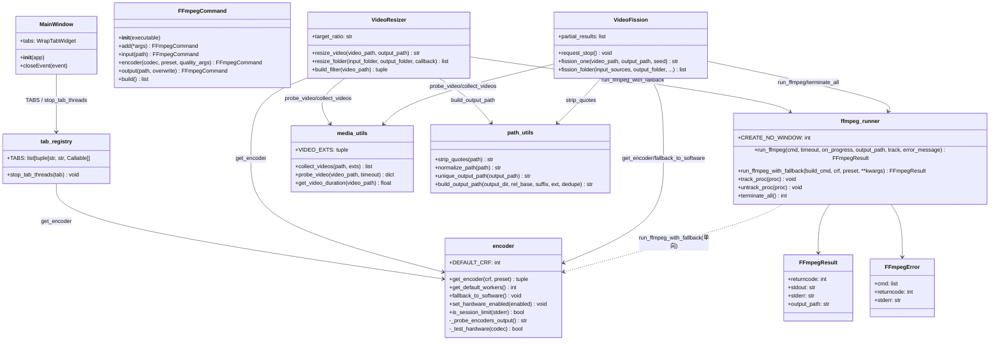
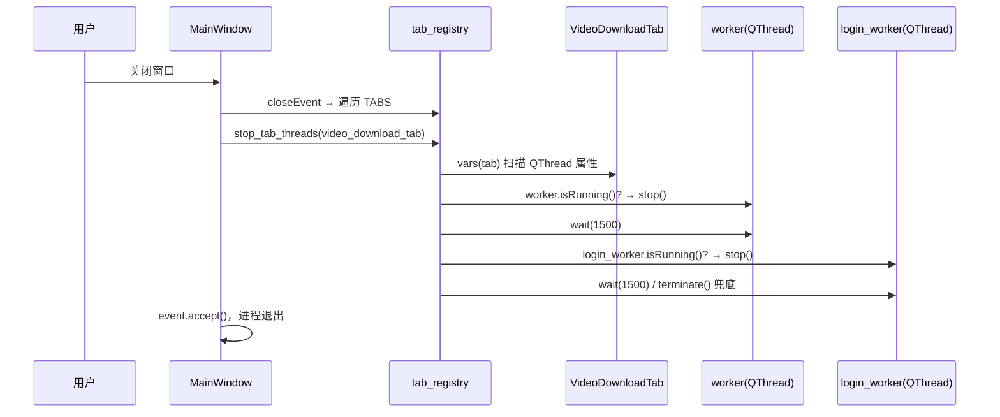
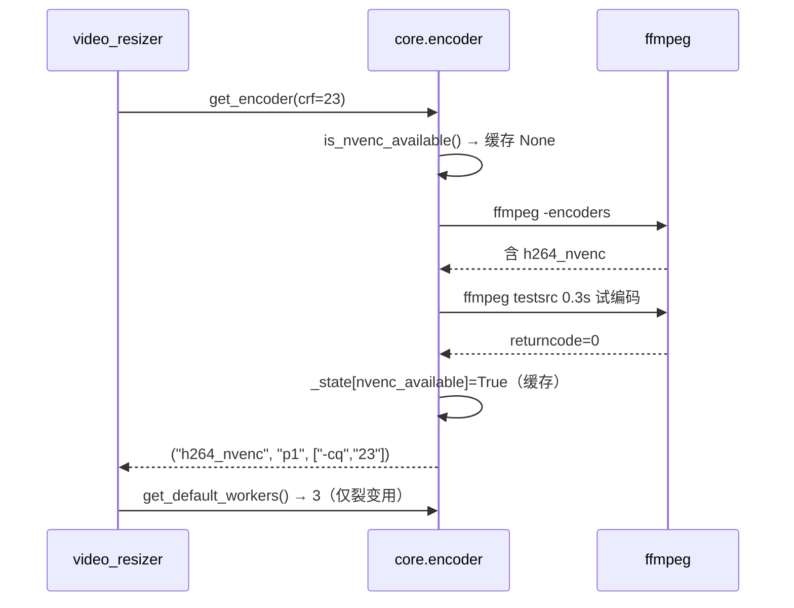
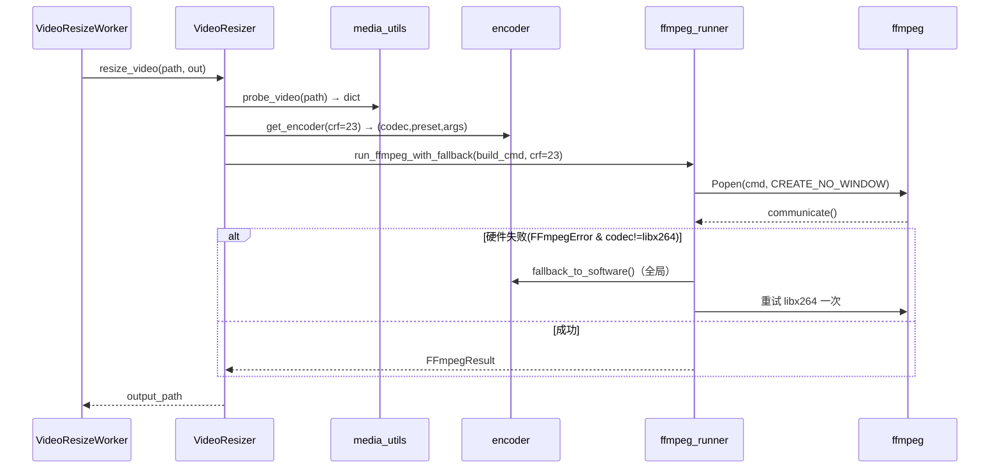
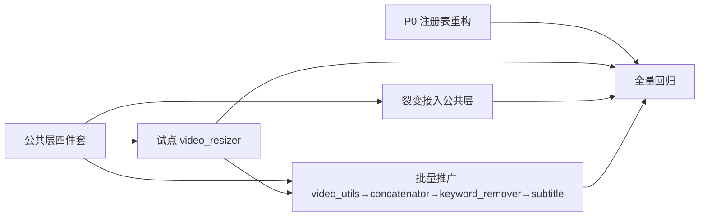

# 增量重构设计（P0 + P1）— video_random_cut_mimo

> 版本：v1.0 ｜ 作者：高见远（架构师）｜ 日期：2026-08-19
> 上游：`docs/refactor-prd-p0p1.md`（许清楚，v1.0）
> 文档类型：详细设计 + 任务分解，**可直接指导工程师写代码**
> 约束：只读分析完成，本文档不修改任何源码；重构期间项目必须保持可用；每步独立 `git commit` + `git push`

---

## 0. 设计决策速览（Open Questions 结论）

| # | 问题 | 结论 |
|---|---|---|
| OQ1 | NVENC `-cq` 与 x264 `crf` 映射口径 | **P1 默认 `cq = crf` 直映**（保持裂变现状 `p1 + -cq crf`），不做 UI 开关；验收用 AC-P1-5 ffprobe 字段 + R2 三方对比（体积/SSIM/肉眼）。不达标再调 `-cq` 档位（预留 `NVENC_CQ_OFFSET` 常量，默认 0） |
| OQ2 | cut 系列现状无 setsar 是否本次补 | **纳入**：`cut_video / cut_video_fast / cut_video_no_audio` 显式补 `-vf setsar=1`（千川合规加固），纳入 AC-P1-5 回归；这是本次**唯一允许的滤镜链变更**，其余模块滤镜链一律不动 |
| OQ3 | wink_enhancer 8 元组格式列表 | **P1 保持 5 元组**（`.mp4 .avi .mov .mkv .flv`），wink_enhancer 不动；扩展列表合并记入 P2 |
| OQ4 | runner 超时默认值 | `run_ffmpeg(timeout=3600)` 默认 3600（与裂变现状一致）；**调用方显式传原值**（3600/600/300/120/60 保持现状），不强制统一 |

---

## Part A：系统设计

### A.1 实现方案（Implementation Approach）

**核心难点**：
1. 编码策略从"裂变私有"上提为全局单点，且不能被多标签页并发调用时重复探测/互相踩踏；
2. 14 处 `libx264` 硬编码替换后，必须保证输出行为一致性（尤其 **SAR=1:1** 与 9:16 规格，千川硬校验）；
3. subprocess 统一封装要兼顾裂变的"中断 + 回退重试"既有编排，不能破坏 `partial_results` / 随机时间戳语义；
4. P0 注册表重构要消除"4 处手写平行列表"与 `login_worker` 泄漏，且不能动 16 个 tab 的任何业务代码。

**框架/库选型**：零新依赖。全部基于标准库 `subprocess / os / json / threading / contextlib / dataclasses` + 既有 PyQt5/QThread。ffmpeg/ffprobe 走系统 PATH（与现状一致）。

**架构模式**：
- 公共层采用 **模块级函数 + 轻量数据类**（不引入类框架），避免过度抽象：
  - `core/encoder.py`：策略模块（探测 + 缓存 + 回退），**模块级状态**（带锁，进程内单例语义）；
  - `core/ffmpeg_runner.py`：执行模块（进程追踪 + 超时 + 半成品清理 + 进度解析），全局进程注册表；
  - `utils/media_utils.py` / `utils/path_utils.py`：纯工具（只依赖标准库）。
- 业务层采用 **依赖注入式改造**：各模块保留自身编排（串行循环、回退重试、中断逻辑），只把"编码参数获取 / 进程执行 / 探测 / 路径"四个点替换为公共层调用。
- GUI 层 P0 采用 **注册表（Registry）模式**：`TABS` 列表驱动 import/实例化/addTab/closeEvent。

**导入方向（杜绝循环 import）**：
```
标准库
  ├── utils/media_utils.py   （仅 stdlib）
  ├── utils/path_utils.py    （仅 stdlib）
  ├── core/encoder.py        （仅 stdlib）
  └── core/ffmpeg_runner.py  （仅 stdlib + core.encoder【单向】）

业务层 → 公共层：
  core/video_resizer.py      → media_utils / encoder / ffmpeg_runner / path_utils
  core/video_fission.py      → media_utils / encoder / ffmpeg_runner / path_utils
  core/video_concatenator.py → media_utils / encoder / path_utils
  core/keyword_remover.py    → media_utils / encoder
  utils/video_utils.py       → media_utils（转发）/ encoder
  gui/subtitle_tab.py        → encoder
```
> 唯一跨层依赖：`core/ffmpeg_runner.py` import `core/encoder.py`（用于 `run_ffmpeg_with_fallback` 的硬件回退判断）；`encoder` **不** import runner，无环。公共模块**禁止** import 任何 `core/` 业务模块与 `gui/`。

---

### A.2 P0 主窗口注册表设计

#### A.2.1 现状问题（读码确认）

| 现状 | 证据 |
|---|---|
| 一个 tab 要改 4 处 | `gui/main_window.py`：import L3-18、实例化 L118-133、addTab L135-150、closeEvent 清理列表 L154-162 |
| closeEvent 漏 `settings_tab` | 清理列表 15 项 vs addTab 16 项；`settings_tab` 实例化于 L130 但不在清理列表 |
| `login_worker` 泄漏 | `gui/video_download_tab.py:133-134` 双 QThread 属性 `worker` / `login_worker`；closeEvent 只取 `worker` |
| 停止协议不完整 | 裂变 `VideoFissionWorker` 只有 `request_stop()` 没有 `stop()`，现 closeEvent `hasattr(worker, "stop")` 不会调用它 |

#### A.2.2 方案：单一注册表 `gui/tab_registry.py`（新增）

```python
# gui/tab_registry.py
"""标签页单点注册表。

新增/删除一个 tab：只改本文件（顶部 import + TABS 加一行），
实例化 / addTab / closeEvent 清理全部自动跟随，无需再改 main_window.py。
"""
from typing import Any, Callable, List, Tuple

from PyQt5.QtCore import QThread
from PyQt5.QtWidgets import QWidget

from gui.slice_tab import SliceTab
from gui.text_recognition_tab import TextRecognitionTab
from gui.audio_mix_tab import AudioMixTab
from gui.video_mix_tab import VideoMixTab
from gui.video_concat_tab import VideoConcatTab
from gui.video_resize_tab import VideoResizeTab
from gui.video_enhance_tab import VideoEnhanceTab
from gui.keyword_remove_tab import KeywordRemoveTab
from gui.face_detection_tab import FaceDetectionTab
from gui.screenshot_tab import ScreenshotTab
from gui.subtitle_tab import SubtitleTab
from gui.settings_tab import SettingsTab
from gui.kaipai_cloud_tab import KaipaiCloudTab
from gui.voice_clone_tab import VoiceCloneTab
from gui.video_fission_tab import VideoFissionTab
from gui.video_download_tab import VideoDownloadTab

# 元素：(属性名, 显示标题, 工厂函数)
# 工厂统一签名 factory(app) -> QWidget；不需要 app 的 tab 忽略参数即可。
# 属性名必须与现有 self.<name>_tab 一致（外部可能引用）。
TabFactory = Callable[[Any], QWidget]

TABS: List[Tuple[str, str, TabFactory]] = [
    ("slice_tab",            "视频切片", lambda app: SliceTab()),
    ("screenshot_tab",       "视频截图", lambda app: ScreenshotTab()),
    ("text_recognition_tab", "文字识别", lambda app: TextRecognitionTab()),
    ("face_detection_tab",   "人脸识别", lambda app: FaceDetectionTab()),
    ("audio_mix_tab",        "音频混剪", lambda app: AudioMixTab()),
    ("video_mix_tab",        "视频混剪", lambda app: VideoMixTab()),
    ("video_concat_tab",     "视频拼接", lambda app: VideoConcatTab()),
    ("video_resize_tab",     "视频尺寸", lambda app: VideoResizeTab()),
    ("video_enhance_tab",    "视频优化", lambda app: VideoEnhanceTab()),
    ("keyword_remove_tab",   "去关键词", lambda app: KeywordRemoveTab()),
    ("subtitle_tab",         "视频字幕", lambda app: SubtitleTab()),
    ("kaipai_cloud_tab",     "开拍云端", lambda app: KaipaiCloudTab()),
    ("video_fission_tab",    "视频裂变", lambda app: VideoFissionTab()),
    ("voice_clone_tab",      "音色复刻", lambda app: VoiceCloneTab()),
    ("video_download_tab",   "视频下载", lambda app: VideoDownloadTab()),
    ("settings_tab",         "设置",     lambda app: SettingsTab(app)),  # 唯一需要 app 参数
]


def stop_tab_threads(tab: QWidget) -> None:
    """停止一个 tab 上所有 QThread 类型属性（覆盖 worker / login_worker / 未来任意 *_worker）。

    协议：优先 stop()，其次 request_stop() → wait(1500) → 仍运行则 terminate() → wait(1500)。
    与现状 main_window.closeEvent 的顺序完全一致，只是由"手写属性名列表"改为"vars(tab) 全量扫描"。
    """
    for _name, obj in vars(tab).items():
        if not isinstance(obj, QThread):
            continue
        if not obj.isRunning():
            continue
        if hasattr(obj, "stop"):
            try:
                obj.stop()
            except Exception:
                pass
        elif hasattr(obj, "request_stop"):
            try:
                obj.request_stop()
            except Exception:
                pass
        if not obj.wait(1500):
            obj.terminate()
            obj.wait(1500)
```

#### A.2.3 `gui/main_window.py` 改造后骨架

```python
# gui/main_window.py
from PyQt5.QtWidgets import QMainWindow, QWidget, QVBoxLayout, QHBoxLayout, QPushButton, QFrame
from PyQt5.QtCore import Qt, pyqtSignal

from gui.tab_registry import TABS, stop_tab_threads
# 注意：不再 import 16 个 tab 类（注册表统一负责）

class WrapTabWidget(QWidget):
    ...  # 原样保留，不动

class MainWindow(QMainWindow):
    def __init__(self, app):
        super().__init__()
        self.setWindowTitle("视频混剪工具")
        self.setMinimumSize(900, 700)
        self.tabs = WrapTabWidget()
        self.setCentralWidget(self.tabs)

        # ── 注册表驱动：实例化 + addTab（顺序 = TABS 顺序，即原 addTab L135-150 顺序）──
        for attr, title, factory in TABS:
            tab = factory(app)
            setattr(self, attr, tab)
            self.tabs.addTab(tab, title)

    def closeEvent(self, event):
        """关闭窗口时停止所有后台线程，确保进程（及启动它的终端）能随之退出。"""
        for attr, _title, _factory in TABS:
            tab = getattr(self, attr, None)
            if tab is not None:
                stop_tab_threads(tab)
        event.accept()
```

**关键点**：
- 显示顺序 = `TABS` 列表顺序，与原 addTab L135-150 完全一致（slice→screenshot→text_recognition→face_detection→audio_mix→video_mix→video_concat→video_resize→video_enhance→keyword_remove→subtitle→kaipai_cloud→video_fission→voice_clone→video_download→settings）。
- 属性名保留 `self.slice_tab` 等原名（`setattr` 写回），外部引用不破坏。
- `SettingsTab(app)` 通过工厂 `lambda app: SettingsTab(app)` 注入 app，其余工厂忽略参数。
- closeEvent 由 `vars(tab)` 全量扫描 QThread 属性：自动覆盖 `worker`、`login_worker`（video_download_tab 双线程泄漏修复）、以及未来任何新增 `*_worker` 属性。
- 停止协议：`stop()` 优先（如 audio_mix/slice/kaipai/video_download/video_enhance/voice_clone 的 worker），`request_stop()` 兜底（VideoFissionWorker），最后 `wait(1500)` 未退则 `terminate()`——顺序与现状完全一致。

**配套小改**（同一 P0 提交）：
- `gui/video_download_tab.py`：给 `LoginWorker` 增加 `stop()` 方法（设标志位，`run()` 里轮询；即使网络阻塞无法及时中断，closeEvent 的 wait→terminate 兜底仍会生效），使登录线程也走优雅停止协议。

#### A.2.4 P0 验收对照

| AC | 如何满足 |
|---|---|
| AC-P0-1 单点注册 | 增删 tab 只改 `gui/tab_registry.py` 的 import + TABS 一行；main_window 无任何平行列表（grep `self.\w+_tab =` 与 `addTab(` 仅出现在注册表驱动处） |
| AC-P0-2 清理自动跟随 | `stop_tab_threads` 用 `vars(tab)` 全量扫描，覆盖 `login_worker`；新增带 worker 的 tab 无需改 closeEvent |
| AC-P0-3 关窗干净退出 | 保留 stop→wait(1500)→terminate 顺序；关窗后任务管理器无 python 进程悬挂 |
| AC-P0-4 功能不回归 | 16 个 tab 顺序/标题/功能与迁移前一致；`python main.py` 可启动 |

---

### A.3 公共模块接口定义（关键产出）

#### A.3.1 `core/encoder.py` — 编码策略（单点维护）

```python
"""编码策略公共模块：硬件探测（NVENC）+ 软件回退 + 默认并发数。"""

import os
import subprocess
import threading

DEFAULT_CRF = 20                 # 裂变现状默认 crf
DEFAULT_PRESET = "ultrafast"     # 软件编码默认 preset
NVENC_PRESET = "p1"              # 本机实测最快档（裂变现状）
NVENC_WORKERS = 3                # 消费级卡 NVENC 同时会话 3~5，取 3
SOFTWARE_WORKERS_CAP = 8         # 软件编码并发上限
NVENC_CQ_OFFSET = 0              # OQ1：cq 相对 crf 的偏移，默认 0（cq = crf）；不达标时调整用
_DETECT_TIMEOUT = 30             # -encoders 探测超时
_TEST_DURATION = 0.3             # testsrc 试编码时长（裂变现状 0.3s）

# ── 模块级缓存（带锁，进程内单例）────────────────────────────
_state = {
    "nvenc_available": None,     # None=未知 / True / False（探测结果缓存）
    "forced": None,              # None=自动 / True=强制硬件 / False=强制软件（测试钩子）
}
_lock = threading.Lock()


def _probe_encoders_output() -> str:
    """ffmpeg -encoders 输出（含 stderr）；失败返回空串。"""
    try:
        r = subprocess.run(
            ["ffmpeg", "-hide_banner", "-encoders"],
            capture_output=True, text=True, errors="ignore", timeout=_DETECT_TIMEOUT,
        )
        return (r.stdout or "") + (r.stderr or "")
    except Exception:
        return ""


def _test_hardware(codec: str) -> bool:
    """用 0.3s testsrc 试编码实测硬件编码器能否正常打开（对齐裂变 _test_hardware）。"""
    try:
        r = subprocess.run(
            ["ffmpeg", "-f", "lavfi", "-i",
             "testsrc=duration=0.3:size=128x128:rate=10",
             "-c:v", codec, "-f", "null", "-"],
            capture_output=True, timeout=20,
        )
        return r.returncode == 0
    except Exception:
        return False


def is_nvenc_available() -> bool:
    """NVENC 是否可用（带缓存，首次探测后缓存结果；1s 内返回，AC-P1-1）。"""
    with _lock:
        forced = _state["forced"]
        if forced is not None:
            return forced
        cached = _state["nvenc_available"]
    if cached is not None:
        return cached
    # 双检锁：并发首调只探测一次
    with _lock:
        if _state["nvenc_available"] is None:
            ok = ("h264_nvenc" in _probe_encoders_output()
                  and _test_hardware("h264_nvenc"))
            _state["nvenc_available"] = ok
        return _state["nvenc_available"]


def get_encoder(crf: int = DEFAULT_CRF, preset: str = DEFAULT_PRESET):
    """获取编码器配置（带缓存）。

    Returns:
        (codec, preset, quality_args)
        NVENC:  ("h264_nvenc", "p1", ["-cq", "20"])
        软件:   ("libx264", "ultrafast", ["-crf", "20"])
    用法：cmd += ["-c:v", codec, "-preset", preset] + quality_args
    """
    if is_nvenc_available():
        cq = max(0, int(crf) + NVENC_CQ_OFFSET)
        return ("h264_nvenc", NVENC_PRESET, ["-cq", str(cq)])
    return ("libx264", preset, ["-crf", str(crf)])


def get_default_workers() -> int:
    """默认并发数：NVENC=3；软件=min(核数, 8)（AC-P1-1）。"""
    if is_nvenc_available():
        return NVENC_WORKERS
    return min(os.cpu_count() or 4, SOFTWARE_WORKERS_CAP)


def fallback_to_software() -> None:
    """硬件编码会话受限/失败时强制回退软件（进程内全局生效，避免其他模块再撞 NVENC 限制，R5）。"""
    with _lock:
        _state["nvenc_available"] = False


def set_hardware_enabled(enabled: bool | None) -> None:
    """测试钩子（AC-P1-2）：None=恢复自动探测；False=强制软件；True=强制硬件（跳过探测）。"""
    with _lock:
        _state["forced"] = enabled


def is_session_limit(stderr: str) -> bool:
    """判断 ffmpeg 报错是否为硬件编码会话受限（从 video_fission._is_session_limit 上提，行为不变）。"""
    e = (stderr or "").lower()
    return any(k in e for k in (
        "opencodingsession", "session", "concurrent", "too many",
        "failed to create", "insufficient device memory", "cuda error"))
```

**实现要点（从 `video_fission.py:68-116` 上提）**：
- 保留 `-encoders` 探测（含 h264_nvenc 关键字）+ 0.3s testsrc 试编码双保险；
- **只探测 NVENC**，不探测 QSV（本环境实测 QSV 慢于软件，裂变已注释排除）；不做多编码器轮询；
- 缓存的是"硬件可用性"布尔值，而非具体 (codec,preset,args)——这样不同模块传不同 crf 也能即时正确拼接；
- 首次探测 ≤1s（0.3s 试编码 + 几十 ms 列表探测），满足 AC-P1-1；
- `fallback_to_software()` 是**全局回退**：裂变命中会话受限后，同进程内其余模块也自动走软件，符合 R5"全局保留回退"。

#### A.3.2 `core/ffmpeg_runner.py` — 统一 subprocess 封装

```python
"""统一 ffmpeg 执行封装：CREATE_NO_WINDOW / 进程追踪 / 超时 kill+清理 / 进度回调。"""

import os
import subprocess
import sys
import threading
from dataclasses import dataclass, field
from typing import Callable, List, Optional

CREATE_NO_WINDOW = 0x08000000  # Windows 无黑窗（全项目现状均未带，属纯增强，R4）

class FFmpegError(RuntimeError):
    """ffmpeg 执行失败/超时。保留 returncode 与 stderr，供回退编排使用。"""
    def __init__(self, message: str, *, cmd=None, returncode=None, stderr: str = ""):
        super().__init__(message)
        self.cmd = cmd
        self.returncode = returncode
        self.stderr = stderr

@dataclass
class FFmpegResult:
    returncode: int
    stdout: str
    stderr: str
    output_path: Optional[str] = None

# ── 全局进程注册表（从 video_fission._track_proc/_untrack_proc/_procs_lock 上提）────
_procs: set = set()
_procs_lock = threading.Lock()

def track_proc(proc: subprocess.Popen) -> None: ...
def untrack_proc(proc: subprocess.Popen) -> None: ...
def active_procs() -> list: ...
def terminate_all() -> int:
    """终止所有被追踪的活跃进程，返回终止数量（裂变 request_stop 调用，AC-P1-4）。"""

def run_ffmpeg(
    cmd: List[str],
    *,
    timeout: float = 3600,                    # OQ4：默认 3600，调用方显式传原值
    on_progress: Optional[Callable[[dict], None]] = None,  # P1 只提供能力，UI 接入属 P2
    output_path: Optional[str] = None,        # 失败/超时后删除该半成品
    track: bool = True,                       # 是否注册到全局进程表
    error_message: str = "ffmpeg failed",
) -> FFmpegResult:
    """执行 ffmpeg 命令。行为契约：
    1. Windows 下自动 creationflags=CREATE_NO_WINDOW；
    2. cmd 含 `-progress pipe:1` 且 on_progress 非空时，实时解析 stdout 进度行并回调
       （progress dict: {frame, fps, out_time_us, out_time_ms, out_time, speed, progress}）；
    3. 超时：kill 子进程 → 若 output_path 存在则删除 → 抛 FFmpegError("...超时...")；
    4. 失败（returncode != 0）：提取 stderr 尾部（约 500 字符）→ 若 output_path 存在则删除
       → 抛 FFmpegError(f"{error_message}: {stderr_tail}")（RuntimeError 子类，兼容现有 except）；
    5. 成功：返回 FFmpegResult；
    6. track=True 时自动注册/注销；on_progress 回调异常不致命（吞掉并继续）。
    """

def run_ffmpeg_with_fallback(
    build_cmd: Callable[[tuple], List[str]],
    *,
    crf: int = 20,
    preset: str = "ultrafast",
    **run_kwargs,
) -> FFmpegResult:
    """先按硬件编码参数执行；硬件失败（FFmpegError 且 codec != libx264）则全局回退软件重试一次。

    供试点/裂变之外的模块复用回退能力（R5/R6）；裂变保留自身编排，不使用本函数。
    """
    from core.encoder import get_encoder, fallback_to_software
    params = get_encoder(crf=crf, preset=preset)
    try:
        return run_ffmpeg(build_cmd(params), **run_kwargs)
    except FFmpegError as e:
        if params[0] != "libx264":
            fallback_to_software()
            return run_ffmpeg(build_cmd(get_encoder(crf=crf, preset=preset)), **run_kwargs)
        raise


class FFmpegCommand:
    """轻量命令构建器（可选；工程师也可直接用 list + run_ffmpeg）。"""
    def __init__(self, executable: str = "ffmpeg"):
        self._cmd = [executable]
    def add(self, *args) -> "FFmpegCommand": ...
    def input(self, path: str) -> "FFmpegCommand": ...          # -i path
    def encoder(self, codec, preset, quality_args) -> "FFmpegCommand":  # -c:v codec -preset preset + quality_args
    def output(self, path: str, *, overwrite: bool = True) -> "FFmpegCommand":  # [-y] path
    def build(self) -> List[str]: ...
    def __str__(self) -> str: ...
```

**行为契约 / 与现状差异**：

| 项 | 现状 | 改造后 |
|---|---|---|
| 黑窗 | 无 CREATE_NO_WINDOW（R4） | 自动加，纯增强 |
| 超时 | video_utils 超时不清理半成品 | kill + 删除 output_path（行为改进，R7 显式测） |
| 失败 | 各模块自己删残留（fission）或不管 | runner 统一删 output_path 半成品 |
| 进程追踪 | 仅裂变 `_procs` | 全局注册表 `track_proc/untrack_proc/terminate_all` |
| 进度 | 无 | `-progress pipe:1` 解析（P1 能力，P2 接 UI） |
| 回退 | 仅裂变编排 | `run_ffmpeg_with_fallback` 通用化 |

#### A.3.3 `utils/media_utils.py` — 媒体探测/收集/格式常量

```python
"""媒体工具公共模块：格式常量 / 视频探测 / 时长 / 收集。只依赖标准库。"""

import json
import os
import subprocess

VIDEO_EXTS: tuple = (".mp4", ".avi", ".mov", ".mkv", ".flv")  # P1 保持 5 元组（OQ3）


def collect_videos(path: str, exts=VIDEO_EXTS) -> list:
    """收集视频文件（递归）。
    - path 为目录：os.walk 递归，返回排序列表（兼容 video_resizer/keyword_remover 现状）；
    - path 为单文件：匹配 exts 返回 [path]，否则 []（兼容 video_concatenator.get_videos 现状）；
    - 大小写不敏感（.endswith(exts) 前 lower()）。
    """

def probe_video(video_path: str, *, timeout: float = 10.0) -> dict:
    """一次 ffprobe 全量探测（-show_format -show_streams，本地解析）。

    Returns:
        {
            "codec_name": str,           # 视频编码器，如 "h264"
            "width": int, "height": int,
            "pix_fmt": str,              # 如 "yuv420p"（缺失为 ""）
            "r_frame_rate": float,       # 平均帧率（如 30.0）
            "fps": float,                # 同 r_frame_rate（兼容 concatenator 旧调用点）
            "duration": float,           # 秒
            "sample_aspect_ratio": str,  # 如 "1:1"；未知为 "0:1"
            "display_aspect_ratio": str, # 如 "9:16"
            "has_audio": bool,           # 是否存在音频流
        }
    失败（returncode!=0 / 无视频流 / 超时）抛 RuntimeError / subprocess.TimeoutExpired。
    """

def get_video_duration(video_path: str) -> float:
    """视频时长（秒）。实现与现状 utils/video_utils.get_video_duration 等价
    （ffprobe -show_format duration），不加 timeout，保持行为完全一致。
    """
```

**迁移兼容**：
- `utils/video_utils.get_video_duration` 保留为一行转发：`from utils.media_utils import get_video_duration`（不重复实现，未迁移调用方无感）。
- `core/video_resizer.py`、`core/keyword_remover.py` 删除本地 `VIDEO_EXTS` 与 `collect_videos`，改 `from utils.media_utils import VIDEO_EXTS, collect_videos, probe_video`（同函数名 re-export，GUI 层 import 不受影响）。
- `core/video_concatenator.py`：`_probe_video` → `probe_video`（调用点 `ref["fps"]` 仍有效）；`get_videos` → `collect_videos`（行为等价：目录递归 / 单文件返回）；`VIDEO_EXTS` inline 删除。
- `core/video_fission.py`：`from core.video_resizer import collect_videos, probe_video` → `from utils.media_utils import collect_videos, probe_video`；`width, height = probe_video(p)` 调用点适配 dict（`info = probe_video(p); width, height = info["width"], info["height"]`）。

#### A.3.4 `utils/path_utils.py` — 路径工具

```python
"""路径工具公共模块：剥引号 / 规范化 / 输出路径构建。只依赖标准库。"""

import os


def strip_quotes(path: str) -> str:
    """剥离路径首尾空白与成对引号（' " 各一对）。

    行为对齐 video_fission_tab.strip_quotes（video_concatenator.normalize_input_path 等价）：
    p.strip() 后，若 len>=2 且 p[0]==p[-1] 且 p[0] in ('"', "'")，剥掉首尾并再 strip。
    - 空串 → ""
    - '"a/b"' → "a/b"；"'a/b'" → "a/b"；"a/b" → "a/b"；引号在中间（a"b）不误删
    """

def normalize_path(path: str) -> str:
    """输入路径规范化 = strip_quotes(path)。

    刻意不做 os.path.normpath：与现状 video_concatenator.normalize_input_path /
    video_fission 内联剥引号语义完全一致，避免改变相对路径/报错文案行为。
    """

def unique_output_path(output_path: str) -> str:
    """防重名：output_path 不存在则原样返回；存在则追加 _2/_3/... 直到不冲突。

    行为对齐 video_fission.fission_folder 防重名（k 从 2 起）：
    out.mp4 存在 → out_2.mp4 → out_3.mp4 ...
    """

def build_output_path(output_dir: str, rel_base: str, suffix: str,
                      ext: str = ".mp4", dedupe: bool = True) -> str:
    """构建输出路径：os.path.join(output_dir, f"{rel_base}_{suffix}{ext}")，suffix 为空则 f"{rel_base}{ext}"；
    dedupe=True 时套 unique_output_path。对齐 video_resize_tab.engine_target_rel_path 的命名形态。
    """
```

---

### A.4 试点接入方案（video_resizer，四件套完整切换）

#### A.4.1 改造前后对照要点

| 关注点 | 改造前 | 改造后 |
|---|---|---|
| 格式/收集 | 本地 `VIDEO_EXTS`(L6) + `collect_videos`(L19) | `from utils.media_utils import VIDEO_EXTS, collect_videos, probe_video`（同函数名 re-export，GUI 层无感） |
| 探测 | 本地 `probe_video`(L28) 返回 `(w, h)` tuple | `media_utils.probe_video` 返回 dict；**调用点适配**：`src_width, src_height = probe_video(...)` → `info = probe_video(...); src_width, src_height = info["width"], info["height"]`（`build_filter` L92、`matches_target_size` L52 两处） |
| 编码参数 | L126 `-c:v libx264 -preset ultrafast -crf 23` | `codec, enc_preset, quality_args = get_encoder(crf=23)` → `["-c:v", codec, "-preset", enc_preset] + quality_args`（**crf=23 保持现状**，不因迁移改变质量档） |
| 进程执行 | L131 `subprocess.run(..., timeout=3600)` | `run_ffmpeg_with_fallback(lambda enc: build_cmd(enc), crf=23, timeout=3600, output_path=output_path, error_message="resize failed")`（自带硬件失败→软件重试一次，R5/R6） |
| 输出路径 | L146 手写 `f"{rel_base}_{ratio}.mp4"`（无防重名，会覆盖） | `build_output_path(output_folder, rel_base, self.target_ratio.replace(':', 'x'), dedupe=True)`（防重名为行为增强） |
| 滤镜链 | `build_filter/build_pipeline_filter` 含 setsar=1 | **一行不动**（SAR=1:1、偶数尺寸、9:16 规格核心逻辑全部保留） |

#### A.4.2 `resize_video` 改造后骨架

```python
def resize_video(self, video_path, output_path):
    os.makedirs(os.path.dirname(output_path), exist_ok=True)
    filter_type, filter_value = self.build_filter(video_path)   # 滤镜链不动

    def build_cmd(enc_params):
        codec, enc_preset, quality_args = enc_params
        cmd = ["ffmpeg", "-i", video_path]
        if filter_type == "complex":
            cmd.extend(["-filter_complex", filter_value, "-map", "[v]", "-map", "0:a?"])
        else:
            cmd.extend(["-vf", filter_value])
        cmd.extend([
            "-c:v", codec, "-preset", enc_preset,
            *quality_args,
            "-c:a", "aac", "-b:a", "128k",
            "-movflags", "+faststart",
            "-y", output_path,
        ])
        return cmd

    run_ffmpeg_with_fallback(build_cmd, crf=23, timeout=3600,
                             output_path=output_path, error_message="resize failed")
    return output_path
```

**验收流程（试点）**：
1. 迁移前：跑 3~5 个代表素材（9:16 竖屏 / 横屏 / 含音频 / 无音频 / 偶数 / 奇数尺寸）记录**基线耗时**与 ffprobe 快照（`scripts/compare_media.py` 输出）；
2. 迁移后：同素材同机复测，`compare_media.py` 断言 AC-P1-5 字段逐项一致（尤其 SAR=1:1）；
3. 性能：单文件耗时 ≥ 基线 2×（AC-P1-6）；体积/SSIM/肉眼三方对比（R2）。

---

### A.5 14 处 libx264 替换清单

**替换总原则**：编码参数段（`-c:v ... -preset ... -crf ...`）整体换成 `get_encoder()` 拼出的 `["-c:v", codec, "-preset", enc_preset] + quality_args`；**音频参数（-c:a aac -b:a 128k / copy）、滤镜链、-movflags、-pix_fmt、-an、-shortest 等一律不动**。

| # | 文件 | 行号 | 函数 | 替换方式 |
|---|---|---|---|---|
| 1 | utils/video_utils.py | 41 | cut_video | 只换 -c:v 段；**顺带补 `-vf setsar=1`（OQ2）** |
| 2 | utils/video_utils.py | 58 | cut_video_fast | 只换 -c:v 段；**顺带补 `-vf setsar=1`（OQ2）** |
| 3 | utils/video_utils.py | 74 | cut_video_no_audio | 只换 -c:v 段；**顺带补 `-vf setsar=1`（OQ2）** |
| 4 | utils/video_utils.py | 133 | _blur_pad_video（等比例分支） | 只换 -c:v 段 |
| 5 | utils/video_utils.py | 155 | _blur_pad_video（模糊填充分支） | 只换 -c:v 段 |
| 6 | utils/video_utils.py | 198 | image_to_video（同尺寸分支） | 只换 -c:v 段 |
| 7 | utils/video_utils.py | 221 | image_to_video（模糊填充分支） | 只换 -c:v 段 |
| 8 | utils/video_utils.py | 296 | concat_videos | 只换 -c:v 段 |
| 9 | core/video_concatenator.py | 209 | concat_pair | 只换 -c:v 段 |
| 10 | core/video_concatenator.py | 232 | _concat_video_only 归一化 | 只换 -c:v 段 |
| 11 | core/video_concatenator.py | 251 | _concat_video_only concat demuxer 合并 | 只换 -c:v 段 |
| 12 | core/video_resizer.py | 126 | resize_video | **试点**：四件套完整切换（见 A.4） |
| 13 | core/keyword_remover.py | 342 | remove_keyword_ranges | 只换 -c:v 段 |
| 14 | gui/subtitle_tab.py | 143 | _burn_subtitles | 只换 -c:v 段 |

**runner 使用边界（明确）**：
- 完整走 runner（含回退）：试点 `video_resizer`、`video_fission`（Popen 管理上提）。
- 只换编码段、保留 `subprocess.run`：`video_utils`（8 处）、`video_concatenator`（3 处）、`keyword_remover`（1 处）、`subtitle_tab`（1 处）——最小改动原则，runner/回退框架后置 P2 统一（AC-P1-3 由试点 + runner 单测验证）。若工程师在 video_utils 中顺手切换成本极低，可升级为 `run_ffmpeg_with_fallback`，但**不得**因此扩大本次 diff 面。

**video_concatenator 额外清理（同一提交）**：`normalize_input_path`(L12) → `from utils.path_utils import normalize_path`；`get_videos`(L32) → `collect_videos`；`_probe_video`(L56) → `probe_video`；inline `VIDEO_EXTS`(L34) 删除。subprocess 保留。

---

### A.6 数据结构和接口（Mermaid classDiagram）

见 `docs/class-diagram.mermaid`（嵌入主文档也可，独立文件供工具渲染）。



---

### A.7 程序调用流程（Mermaid sequenceDiagram）

见 `docs/sequence-diagram.mermaid`。核心 3 条：

**① P0 关窗清理（closeEvent）**


**② encoder 首次探测 + 缓存**


**③ resize_video 改造后执行 + 回退**


---

### A.8 回归脚本设计（scripts/compare_media.py）

**路径建议**：`scripts/compare_media.py`（根目录 `scripts/` 已存在）。

**用途**：迁移前后输出行为一致性对比（AC-P1-5），试点与每个模块迁移复用。

```python
# scripts/compare_media.py
"""ffprobe 对比脚本：迁移前后输出参数一致性断言。

用法:
  python scripts/compare_media.py --base before.mp4 --new after.mp4
  python scripts/compare_media.py --base-dir out_before --new-dir out_after
  python scripts/compare_media.py --base-dir out_before --new-dir out_after --strict

对比字段: codec_name / width / height / sample_aspect_ratio / display_aspect_ratio /
         duration / r_frame_rate / pix_fmt
断言（默认）:
  - width/height 一致（分辨率）
  - SAR == "1:1"（千川硬校验；历史 2943:2944 事故防护）
  - DAR 一致（或比值一致）
  - |duration_new - duration_base| <= 0.05s
  - pix_fmt == "yuv420p"（若基线为 yuv420p）
  - 可播放性: ffmpeg -i new -frames:v 1 -f null - 返回 0（抽帧成功）
--strict: 全部字段逐项相等（含 codec_name 之外的 pix_fmt/r_frame_rate 也严格相等）
输出: 逐项对比表 + PASS/FAIL；任一断言失败 exit code != 0（便于脚本化）
依赖: 仅标准库 + ffprobe/ffmpeg（系统 PATH）
"""
```

**Open Question 2 配套**：cut 系列补 `setsar=1` 后，回归断言 `SAR=1:1` 直接覆盖；若某模块现状 SAR≠1，`compare_media.py` 会 FAIL，提示工程师补 setsar（回归脚本即"护栏"）。

---

## Part B：任务分解

### B.1 需要的包

无新增第三方包。仅使用标准库（`subprocess / os / json / threading / dataclasses / contextlib`）与既有 PyQt5（≥5.15）。

```
# 无新增依赖；requirements.txt 不变
```

### B.2 任务列表（按依赖排序，共 5 个任务）

#### T01：P0 主窗口注册表重构（修复注册 bug + login_worker 泄漏）

| 项 | 内容 |
|---|---|
| **文件** | `gui/tab_registry.py`（新增）、`gui/main_window.py`（改造）、`gui/video_download_tab.py`（LoginWorker 增加 stop()） |
| **做什么** | ① 新建注册表：`TABS`（16 项，属性名/标题/工厂，顺序=现 addTab L135-150），`stop_tab_threads()`（vars 全量扫描 QThread → stop/request_stop → wait(1500) → terminate）；② main_window 删除 16 个 import/实例化/addTab/closeEvent 平行列表，改为 TABS 驱动；③ LoginWorker 补 stop()（标志位） |
| **验收点** | AC-P0-1~4：grep `self.\w+_tab =` 与 `addTab(` 无平行残留；closeEvent 覆盖 login_worker；16 tab 顺序/标题不变；`python main.py` 可启动；关窗进程无残留 |
| **依赖** | 无 |
| **commit 粒度** | 1 个 commit：`refactor(gui): P0 主窗口 tab 注册表单点化，修复 closeEvent 清理遗漏` |

#### T02：公共层四件套 + 回归脚本（一次提交）

| 项 | 内容 |
|---|---|
| **文件** | `core/encoder.py`（新增）、`core/ffmpeg_runner.py`（新增）、`utils/media_utils.py`（新增）、`utils/path_utils.py`（新增）、`utils/video_utils.py`（`get_video_duration` 改为一行转发 `from utils.media_utils import get_video_duration`）、`scripts/compare_media.py`（新增） |
| **做什么** | 按 A.3 接口实现四件套（函数签名/行为契约/缓存/进程表/回退）；video_utils 转发不重复实现；compare_media 实现 ffprobe 对比 + 断言 |
| **验收点** | AC-P1-1（get_encoder 本机返回 NVENC p1+cq、get_default_workers=3）；AC-P1-2（`set_hardware_enabled(False)` 返回 libx264、`is_session_limit` 命中）；AC-P1-3（runner 单测：无黑窗/CREATE_NO_WINDOW、失败删半成品、超时 kill 删半成品并抛 FFmpegError、`-progress pipe:1` 回调）；AC-P1-8（`python -m py_compile` + 四模块 import 通过） |
| **依赖** | 无 |
| **commit 粒度** | 1 个 commit：`feat(core): 新增 encoder/ffmpeg_runner/media_utils/path_utils 公共层 + 回归脚本` |

#### T03：试点 video_resizer 四件套完整切换

| 项 | 内容 |
|---|---|
| **文件** | `core/video_resizer.py`（改造）、`gui/video_resize_tab.py`（`collect_videos` 改从 `utils.media_utils` 直连 import；`engine_target_rel_path` 可选换 `build_output_path`）、`scripts/compare_media.py`（使用：迁移前记基线 → 迁移后对比） |
| **做什么** | 按 A.4：probe→media_utils（dict 适配 2 处）、编码参数→get_encoder(crf=23)、subprocess→run_ffmpeg_with_fallback（自带硬件失败→软件重试）、路径→build_output_path；滤镜链一行不动；先跑基线再迁移 |
| **验收点** | AC-P1-5（试点模块 ffprobe 逐项一致、SAR=1:1、可播放）；AC-P1-6（同素材单文件 ≥2×）；R2 体积/SSIM/肉眼三方对比可接受；`python main.py` 冒烟 |
| **依赖** | T02 |
| **commit 粒度** | 1 个 commit：`perf(resize): 试点接入 encoder/runner/media_utils/path_utils（NVENC ≥2×）` |

#### T04：裂变接入公共层（行为不变）

| 项 | 内容 |
|---|---|
| **文件** | `core/video_fission.py`（改造）、`gui/video_fission_tab.py`（`strip_quotes` 删除，改 `from utils.path_utils import strip_quotes`）、`scripts/compare_media.py`（裂变回归使用） |
| **做什么** | ① 删除 `_probe_encoder/_test_hardware/encoder/default_workers/fallback_to_software/_is_session_limit/_track_proc/_untrack_proc/_procs/_procs_lock` 内联实现 → `from core.encoder import get_encoder, get_default_workers, fallback_to_software, is_session_limit`；`from core.ffmpeg_runner import run_ffmpeg, track_proc, untrack_proc, terminate_all`；② `request_stop` 改调 `terminate_all()`；③ `fission_one` 的 Popen/communicate 改 `run_ffmpeg(track=True, timeout=3600, output_path=..., error_message="裂变失败")`，**保留** `_stop_requested` 检查/删半成品/FissionStopped/硬件回退重试/随机时间戳编排；④ import 改 `from utils.media_utils import collect_videos, probe_video`（probe dict 适配）；⑤ `p.strip().strip('"').strip("'")`(L339) 改 `strip_quotes` |
| **验收点** | AC-P1-4（中断→ffmpeg 全 terminate、partial_results 保留）；AC-P1-7（同批 640x360×5 耗时 ≤±10% 基线 1.33s；清元数据/随机 comment/随机时间戳保留）；AC-P1-2 回退演练 |
| **依赖** | T02（与 T03 可并行） |
| **commit 粒度** | 1 个 commit：`refactor(fission): 裂变接入公共 encoder/runner，行为不变` |

#### T05：批量推广 + 全量回归

| 项 | 内容 |
|---|---|
| **文件** | `utils/video_utils.py`（8 处）、`core/video_concatenator.py`（3 处 + 工具导入）、`core/keyword_remover.py`（1 处 + 工具导入）、`gui/subtitle_tab.py`（1 处）；使用 `scripts/compare_media.py` 逐模块回归 |
| **做什么** | ① video_utils：8 处 `-c:v` 段换 get_encoder(crf=23)（cut 系列 3 处顺带 `-vf setsar=1`）；`_probe_video_profile` → `probe_video`（dict 兼容：codec_name/width/height/pix_fmt/r_frame_rate 字段名一致）；② concatenator：3 处换段 + `normalize_input_path→normalize_path` + `get_videos→collect_videos` + `_probe_video→probe_video`；③ keyword_remover：1 处换段 + `VIDEO_EXTS/collect_videos→media_utils`；④ subtitle_tab：1 处换段。**音频/滤镜/movflags 一律不动** |
| **验收点** | 每模块迁移后跑 AC-P1-5（3~5 代表素材 ffprobe 逐项一致 + SAR=1:1 + 可播放）+ AC-P1-6（≥2×）；全量 `python -m py_compile` + import 冒烟 + `python main.py` 16 tab 可用（AC-P1-8/9）；每步提交后 main.py 冒烟 |
| **依赖** | T02、T03（试点验证方法后可复制推广） |
| **commit 粒度** | 4 个 commit（每模块一个）：
  - `perf(video_utils): 8 处编码段切换 NVENC + cut 系列补 setsar`
  - `perf(concatenator): 3 处编码段切换 NVENC + 公共工具导入`
  - `perf(keyword_remover): 编码段切换 NVENC + media_utils 导入`
  - `perf(subtitle): 字幕烧录切换 NVENC`
  最终跑一次全量回归（compare_media 全模块 + 性能汇总），可加 1 个 `test: 全量回归记录` commit（可选） |

**总 commit 数**：T01×1 + T02×1 + T03×1 + T04×1 + T05×4（+可选回归 1）= **8~9 个**，每步均可独立 revert。

---

### B.3 任务依赖图



> 并行说明：T01 与 T02 互不依赖可并行；T03/T04 均只依赖 T02 可并行；T05 依赖 T02 + T03（试点验证方法）。任务链非严格线性，但**建议执行顺序**：T01 → T02 → T03 → T04 → T05（每步提交后 `python main.py` 冒烟）。

---

### B.4 共享知识 / 约定（工程师必读）

1. **编码参数单点**：所有 `-c:v` 段必须通过 `core.encoder.get_encoder()` 获取；**禁止再写死 `libx264 -preset ultrafast -crf 23`**。音频参数（`-c:a aac -b:a 128k` / `copy`）、`-movflags +faststart`、`-pix_fmt yuv420p`、`-an`、`-shortest` 保持原样。
2. **滤镜链冻结**：除 OQ2 明确允许的 cut 系列补 `setsar=1` 外，任何模块的 scale/crop/setsar/blur/overlay 一律不动（SAR=1:1 是千川硬校验，历史事故 2943:2944）。
3. **公共模块纯净性**：`utils/media_utils.py`、`utils/path_utils.py`、`core/encoder.py`、`core/ffmpeg_runner.py` **禁止 import 任何 `core/` 业务模块与 `gui/`**；只依赖标准库（runner 允许单向依赖 encoder）。出现循环 import 视为实现错误。
4. **探测一次、全局生效**：encoder 模块级缓存；`fallback_to_software()` 为进程内全局回退（NVENC 会话受限后所有模块自动转软件，R5）。
5. **失败删除半成品**：凡走 `run_ffmpeg(output_path=...)` 的调用，失败/超时后输出目录不得残留半成品（AC-P1-3/R7）。
6. **异常兼容**：`FFmpegError` 是 `RuntimeError` 子类，现有 `except RuntimeError` 全部兼容；新代码可读 `e.stderr` / `e.returncode`。
7. **提交纪律**：每步独立 `git commit` + `git push`；每次提交后 `python main.py` 冒烟；任何一步失败可单独 `git revert`。
8. **基线先行**：T03 迁移前必须先记录基线耗时与 ffprobe 快照（用 `scripts/compare_media.py`），迁移后对比。
9. **性能验收口径**：G2 目标 5 个重编码模块单文件 ≥2×（NVENC vs libx264，同机同素材，保守验收 ≥2×）。
10. **P1 边界**：GUI 层 19 处 inline 格式列表、wink_enhancer 8 元组、UI 进度接入、批量并发、ConfigStore 等一律不做（P2/P3 backlog，PRD 已明示）。

---

### A.9 Anything UNCLEAR / 假设

1. **AC-P1-3 覆盖面解释**："所有 P1 迁移调用统一走 runner" 按**试点（video_resizer）+ 裂变 + runner 单测**验证；只换编码段的 4 个模块（video_utils/concatenator/keyword_remover/subtitle_tab）本次保留 `subprocess.run`，runner 全量接入后置 P2。若 QA 严格要求全部走 runner，则把 T05 中每模块的 `subprocess.run` 同步替换为 `run_ffmpeg`（单点替换成本低），需在 PRD 层确认。
2. **`probe_video` 返回结构变化**（tuple→dict）：会影响 `video_resizer.build_filter / matches_target_size` 与 `video_fission._build_filter` 三处调用点，已列入任务；其他未迁移模块（GUI 层）不直接依赖 `probe_video`。
3. **`_probe_video_profile` 失败语义**：现状失败返回默认值 dict（1080x1920@30），改 `probe_video` 后失败抛异常——`concat_videos` 已有 try/except 兜底兼容；`_blur_pad_video` 无兜底会直接报错（更明确，视为合理行为变化）。
4. **防重名 dedupe**：video_resizer 加 `dedupe=True` 后，已存在同名输出不再覆盖而是生成 `_2` 后缀（行为增强）；如业务上依赖覆盖语义需在 PRD 确认。
5. **NVENC 奇数尺寸失败**：试点/裂变有回退兜底；只换编码段的模块暂无自动回退（失败报错），统一回退框架后置 P2（R6 部分缓解）。
